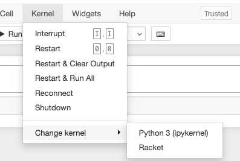

# README

Dependencies
<!-- - OPTIONAL: [Docker](https://www.docker.com/) -->
- [Jupyter](https://jupyter.org/)
- [Racket](https://racket-lang.org/)
- [IRacket](https://docs.racket-lang.org/iracket/index.html):  racket kernel for jupyter
- [Rosette](https://docs.racket-lang.org/rosette-guide/index.html): constraint based solver based on racket


## Setup (No Docker)
1. Download & install Racket, add to path
2. If you don't already have Jupyter locally, run `pip install jupyter`
2. Run:
```sh
raco pkg install iracket
raco iracket install
raco pkg install rosette

jupyter notebook --notebook-dir=$(pwd)
```
4. Open resulting notebook ```http://127.0.0.1:8888/?token=[TOKEN]``` where `TOKEN` is whatever is outputted in the console -->


<!-- ## Setup (Yes Docker)

I'm dockerizing this because I'm not sure I want racket on my local machine forever.

**Steps**
1. Build docker image (this took weirdly long): 

    ```docker build -t racket-rosette .```
2. Run container:  

    ```docker run -p 8888:8888 -v $(pwd):/workspace racket-rosette```

3. open ```http://127.0.0.1:8888/?token=[TOKEN]``` where `TOKEN` is whatever is outputted in the console after `docker run ...` -->


## Selecting Racket Kernel in Jupyter
1. Open a notebook and change the kernel to **Racket**


**If you don't see the racket kernel option**, troubleshoot and manually re-install:
```sh
# if using docker, open new docker shell
docker exec -it <container_id> /bin/bash

# is racket on this list?
jupyter kernelspec list

# if not, do this again
raco pkg install --auto iracket
raco iracket install
raco pkg install --auto rosette

# restart notebook
```

